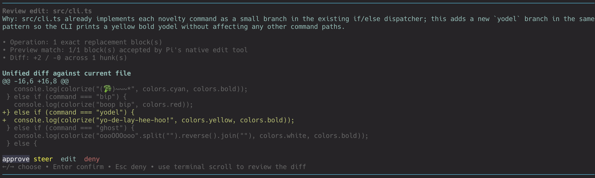

# diffloop

`diffloop` is a Pi extension that puts every `edit` and `write` proposal through a human review loop before the tool executes.



It is designed for cases where you want to inspect file changes, understand why the agent is making them, and either approve, steer, revise, or deny the proposal.

## What it does

This extension intercepts Pi `edit` and `write` tool calls and replaces the default fire-and-forget flow with an interactive review step.

For each proposed file change, diffloop:

- requires the agent to include a `reason`
- normalizes `@path` shorthand to `path`
- shows a diff-oriented preview before execution
- validates `edit` blocks against Pi's native edit semantics
- lets you:
  - **approve** the change
  - **steer** the change with inline feedback
  - **edit** the proposal before execution
  - **deny** the change

## Why use it

Diffloop is useful when you want:

- human approval for every file mutation
- stronger explanations for why a change is being proposed
- a safer workflow for broad or high-risk agent edits
- a fast way to steer proposals without leaving the review view
- visibility into whether an `edit` call will actually match the current file

## Review flow

When the agent proposes an `edit` or `write`:

1. diffloop intercepts the tool call
2. it blocks the call if `reason` is missing or empty
3. it builds a preview of the change
4. it opens a review UI
5. you choose one of the available actions

### Available actions

#### Approve
Runs the tool exactly as proposed.

#### Steer
Keeps the diff preview visible and opens an inline input under the review actions.

Use this when the proposal is close, but you want to redirect it. For example:

- preserve comments
- keep the fallback path unchanged
- follow the existing helper pattern
- avoid changing public behavior

Press:

- `Enter` to send the steering feedback back to the agent
- `Esc` to close the inline steering input and return to the action buttons

#### Edit
Lets you modify the proposed content before execution.

- for `write`, you edit the full file content
- for single-block `edit`, you edit the replacement block directly
- for multi-block `edit`, you choose which block to revise

#### Deny
Blocks the tool call.

## Preview behavior

### Write preview
For `write` proposals, diffloop shows:

- whether the file will be created or overwritten
- file size and line count
- a unified diff against the current file contents

### Edit preview
For `edit` proposals, diffloop:

- normalizes and filters edit blocks
- validates each block with Pi's native edit implementation
- shows warnings for blocks that are not found, not unique, or otherwise invalid
- renders a unified diff of the resulting file when preview validation succeeds

This means the review UI does more than show the requested replacement text: it tries to show what Pi will actually do.

## Agent prompt behavior

This extension re-registers the `edit` and `write` tools with stronger guidance.

It pushes the agent to provide reasons that are:

- specific
- grounded in existing code or repository patterns
- explicit about behavior impact
- not generic prose

## Slash command

```text
/diffloop off
/diffloop on
/diffloop status
```

When enabled, the footer shows the current status.

## Development

### Run tests

```bash
bun test
```

### Type-check

```bash
bun run lint
```